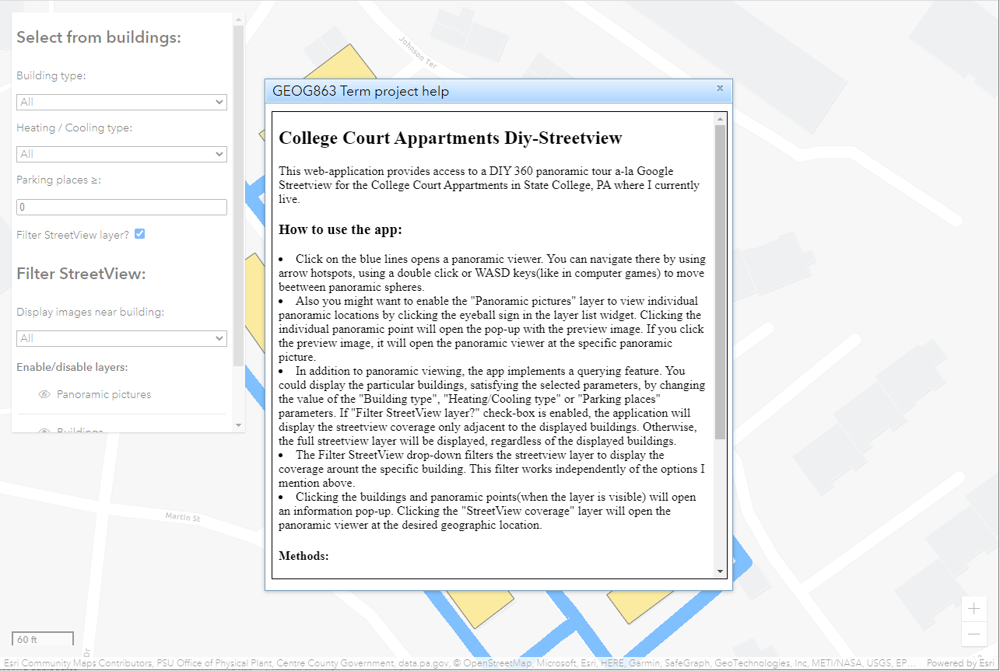
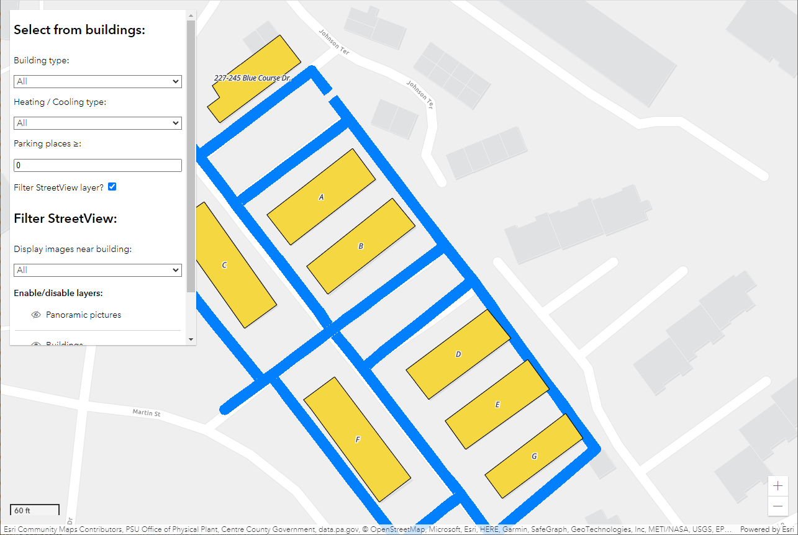
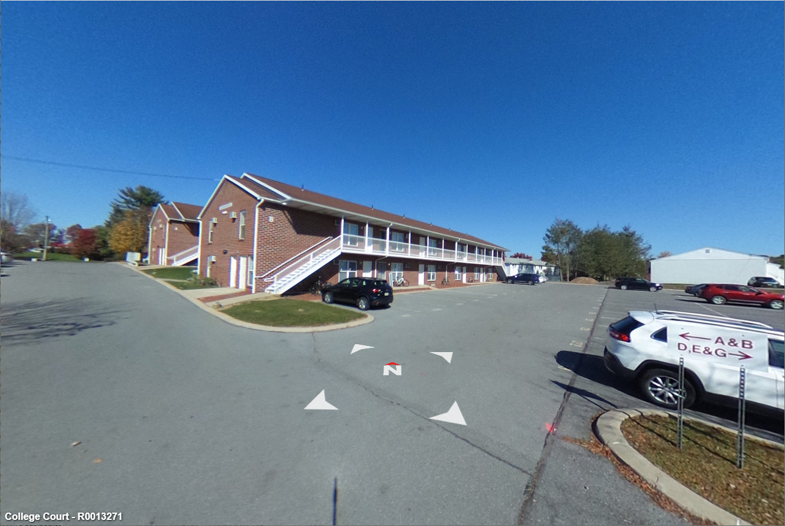
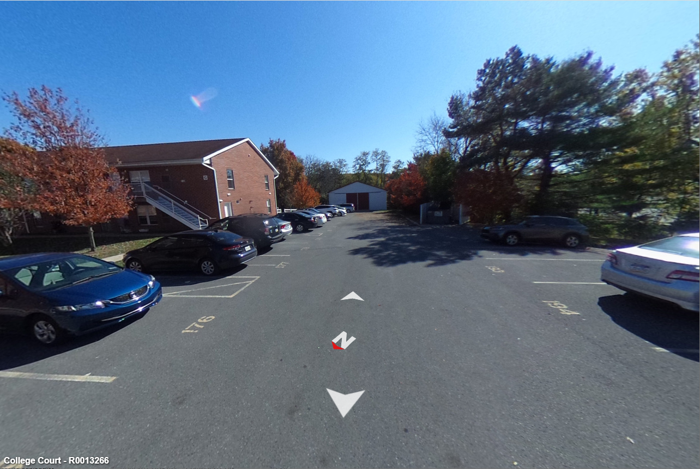

I developed a web application using ArcGIS API for JavaScript and KRPano panoramic viewer that provides access to a DIY 360 panoramic tour of the College Court Apartments in State College, PA. My motivation for this project was to refresh my skills in creating virtual tours and to review how to integrate KRPano with ArcGIS web-maps. I collected images of the College Court complex on 10/22/2022 using an inexpensive consumer-grade Ricoh Theta S panoramic camera. The camera was triggered by GPS coordinates using a simple Python script that I ran on an Android smartphone in QPython environment. I used KRPano, a proprietary HTML5 web panorama viewer, with a commercial license. I also developed the KRPano streetview-like navigation plug-in and created the GIS data, including building footprints, panoramic tour coverage, individual picture locations with associated attributes, and linking of the panoramas.

<a href = "http://www.personal.psu.edu/nvg5370/geog863/term_project/" class="btn btn-outline-dark">Visit web application</a>

## Screenshots (click to enlarge):

   
   
   
   

