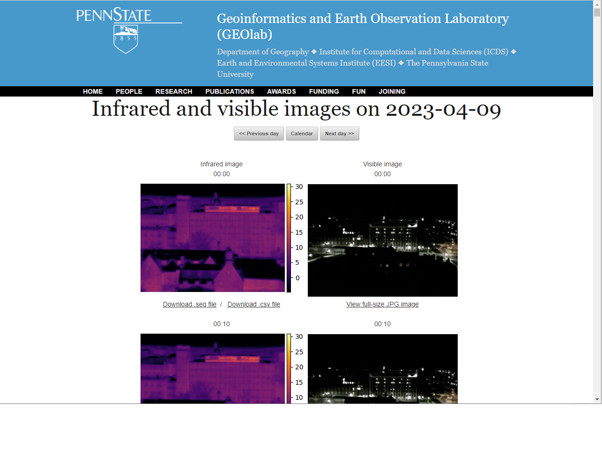
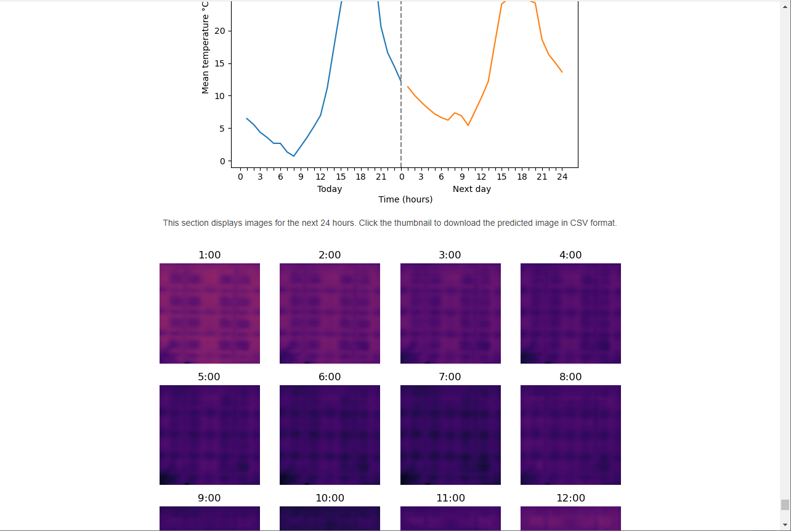

While working on the College of Earth and Mineral Sciences Sustainability Fund project "Thermal Leaks," I created a webpage and set up software to continuously capture thermal and visible light images of the Deike building.
The webpage allows end-users to access thermal and visible light images that are continuously being collected by a Flir A70 thermal camera, positioned on the rooftop of the Walker building, overlooking the Deike building. In addition to viewing the collected data, users can also see images predicted for the next 24 hours using a Long-term Short-term Memory neural network

<a href = "https://gol.pythonanywhere.com/" class="btn btn-outline-dark">Visit web application</a>
<a href = "https://gol.pythonanywhere.com/" class="btn btn-outline-dark">View on GitHub</a>

## Screenshots (click to enlarge):

   
   
   
   
   

