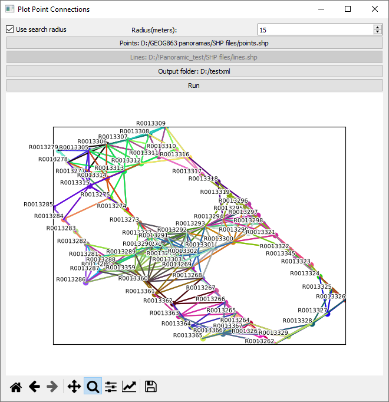
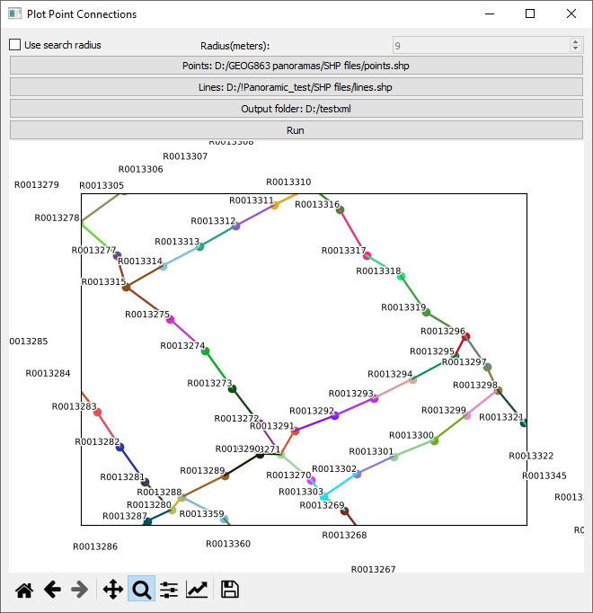
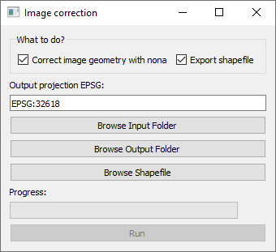

I have developed two Python tools and a GUI for them using PyQt5 to create self-hosted virtual tours, similar to Google Street View, where users can navigate between linked panoramic views. There are two scripts - `convert_panoramas.py` and `visualize_connections.py`.

`convert_panoramas.py` performs geometric correction on the input panoramic images using the embedded compass and gyro information from the image XMP tags, utilizing the Nona application from the Hugin tools. Additionally, it creates a point shapefile representing the locations of the input panoramic images.

The second script, `visualize_connections.py`, links the spherical panoramas to one another by finding the nearest neighbors within a specified search radius or by using a line shapefile representing links between panoramas. Users can create these links in GIS software such as QGIS.

<a href = "https://github.com/ngolosov/PanoramicTools/" class="btn btn-outline-dark">View on GitHub</a>
<a href = "https://github.com/ngolosov/PanoramicTools/releases/download/PanoramicTools/Panoramic_tools_v0.1.zip" class="btn btn-outline-dark">Download Windows binaries</a>

## Screenshots (click to enlarge):

   
   
   

