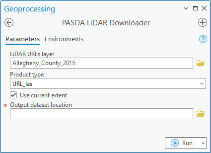

The Commonwealth of Pennsylvania, in collaboration with PSU, provides open access to GIS data for end-users. However, the current official method of downloading files from PASDA at a specific geographic location involves using a web map and manually clicking on links from map pop-ups, which can be inconvenient and impractical for downloading a large number of files.

To address this issue, I have developed a script tool to automate the downloading of LiDAR files and LiDAR-derived products, including LAS, DEMs, and XYZ files, hosted on PASDA. PASDA offers different LiDAR coverages and product types for different years. The script tool prompts the user to select the appropriate coverage layer and product type, and then downloads all the LiDAR or product tiles in the current extent or those intersecting with a selected layer.

As far as I know, there are no ArcGIS or third-party tools specifically designed for automatic downloading of files from PASDA at a specific location, so this script tool could be useful to a wide range of users.

<a href = "https://github.com/ngolosov/pasda-lidar-downloader" class="btn btn-outline-dark">View on GitHub</a>

## Screenshots (click to enlarge):

   

