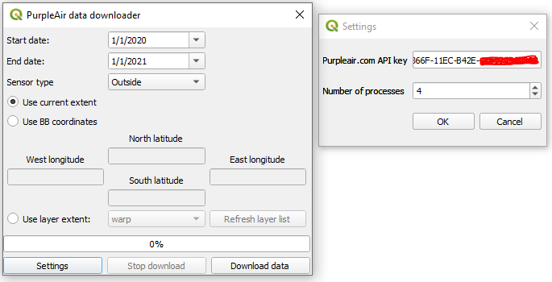

I developed a QGIS plugin to download historical air quality data from the PurpleAir website, using its API. The tool requests a list of sensors and their coordinates within a requested bounding box, and downloads historical data for each sensor within a specified timeframe. It calculates averages for that historical data, and creates a point layer with sensor locations and average pollution attributes, which is added to the map. I used the Requests library to retrieve JSON data, concurrent futures library to retrieve multiple JSON files simultaneously, Pandas to calculate averages, and PyQT5 and QGIS to provide the user with a GUI. The plugin is user-friendly and reusable.

<a href = "https://github.com/ngolosov/PurpleAirDownloader" class="btn btn-outline-dark">View on GitHub</a>

## Screenshots (click to enlarge):

   

