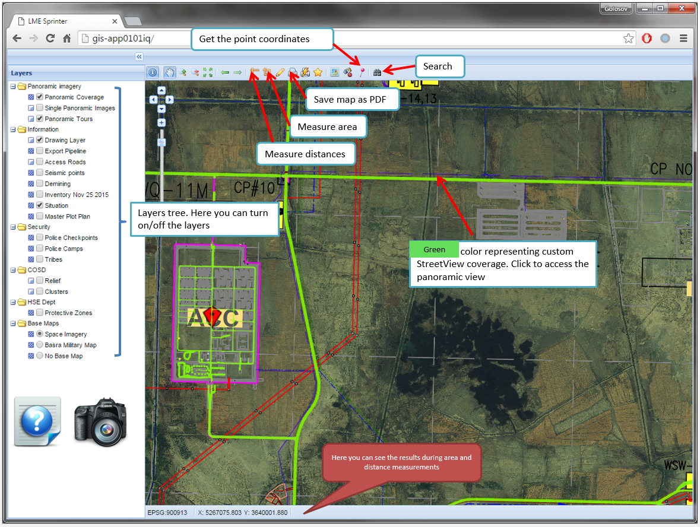
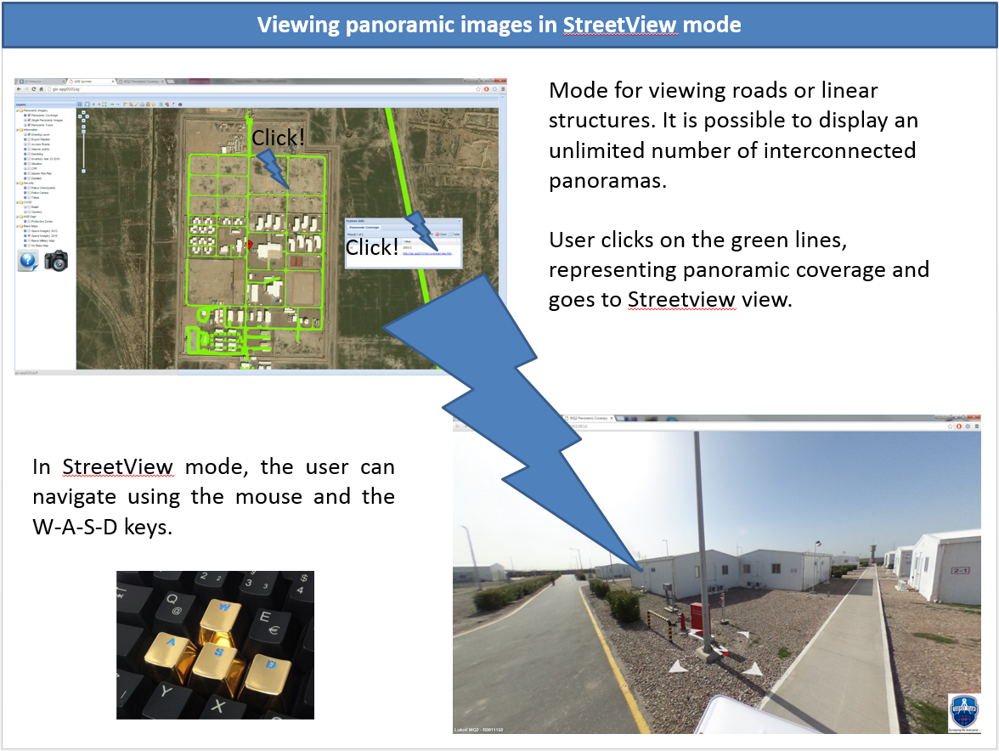
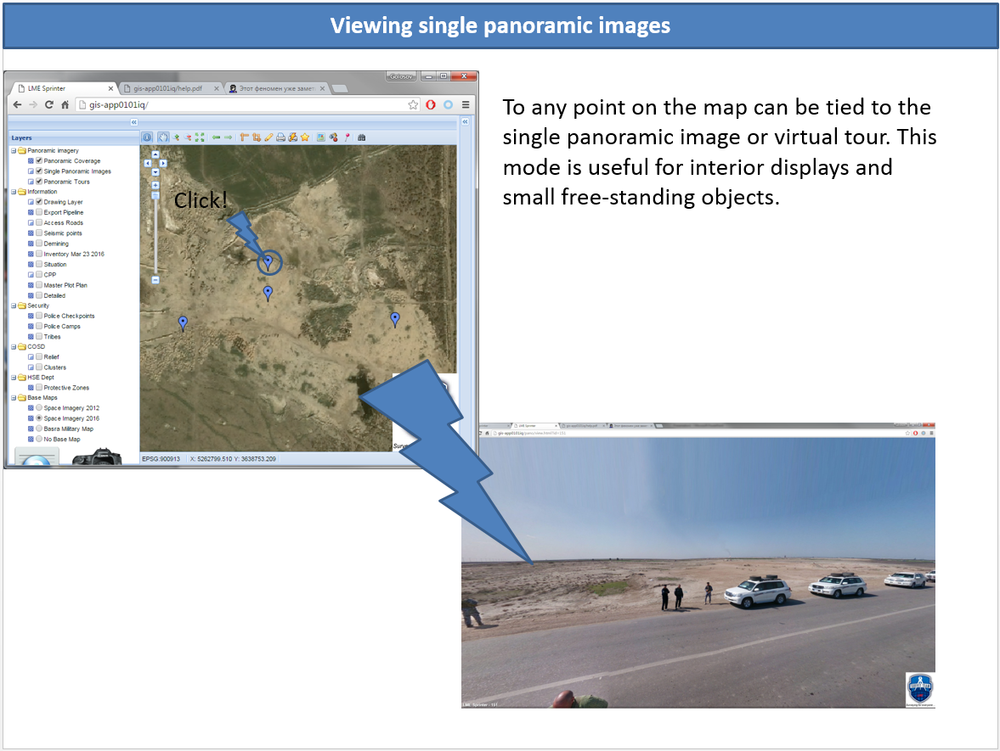
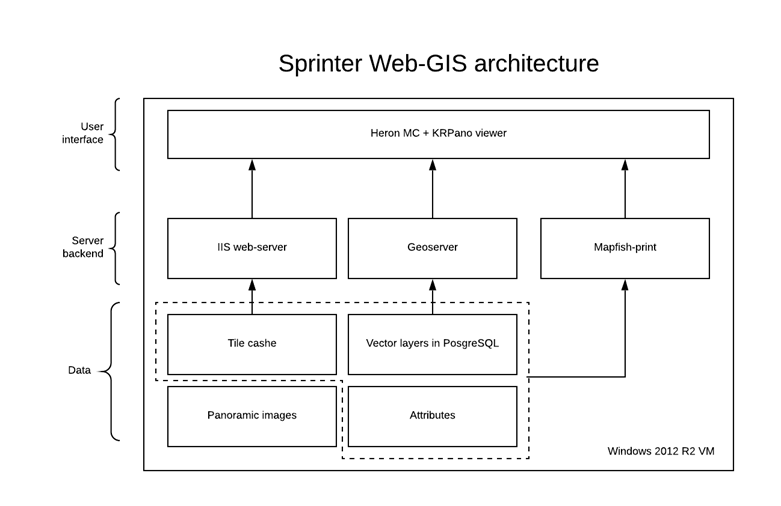

 
   
   
  
  

During this project, I developed a web application called Sprinter Web-GIS to manage 360-degree panoramic images of the West Qurna 2 oilfield located in Basrah, Iraq. As part of the project, I developed the web interface of the system, prepared and published the available spatial data. About 10,000 panoramic images were captured during the project implementation to cover the main roads of the oilfield using the panoramic camera mounted on the roof of a car. To develop the user interface of the system, I mostly used various open-source tools such as the HeronJS JavaScript framework (based on OpenLayers and ExtJS) and the KRPano panoramic viewer. For the backend, I used GeoServer connected to a PostgreSQL database to store spatial data. In addition, I developed helper Python scripts to implement service functions such as coordinate conversion, map bookmark creation, and links shortening. The automation of panoramic image processing (linking panoramic spheres to each other, creating XML files with information about the relationships between images) was done using FME Desktop software.
As a result, the Sprinter Web-GIS provided users with a convenient and fast web interface for viewing panoramic images. All panoramic images were automatically linked to each other, allowing users to view and navigate between panoramic images in the same way as Google StreetView. Additionally, the system facilitated the searching and displaying of various spatial information, such as an oilfield master plot plan and individual objects. Users could also use measurements on a map and search by attributes.
