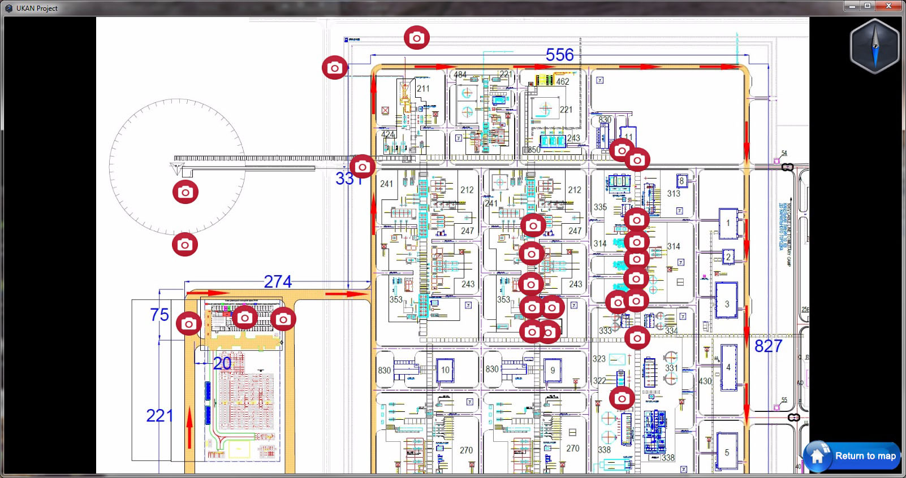
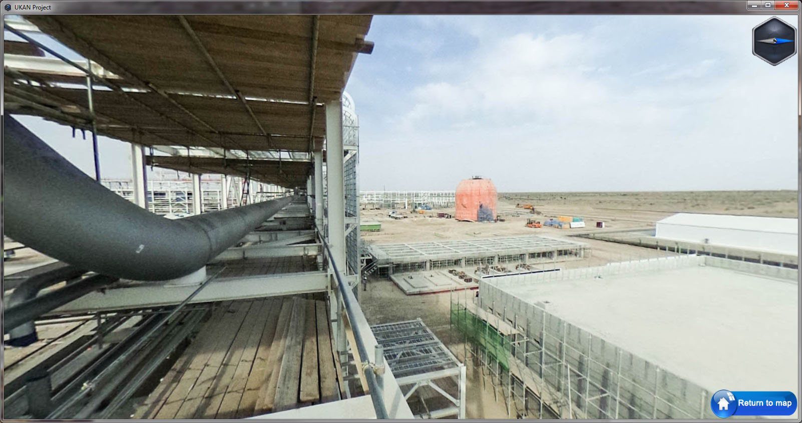
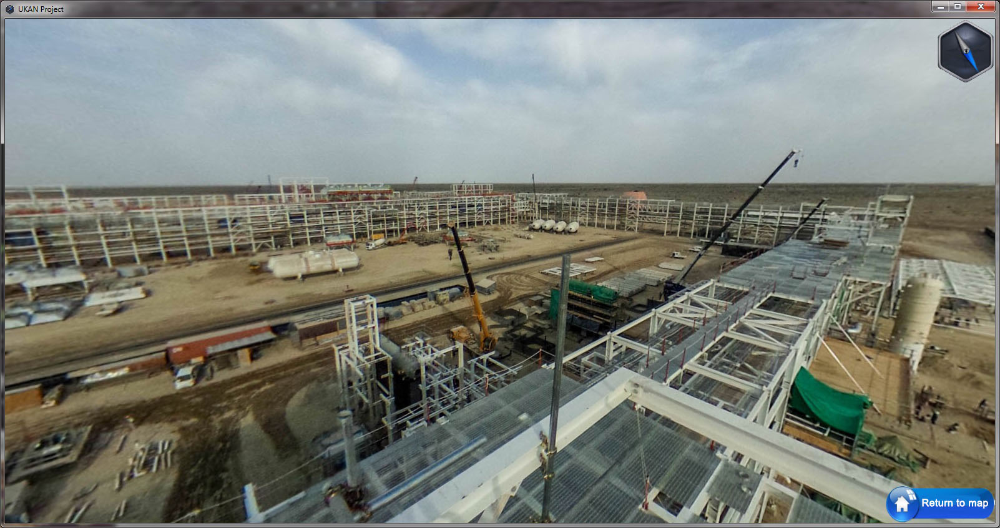
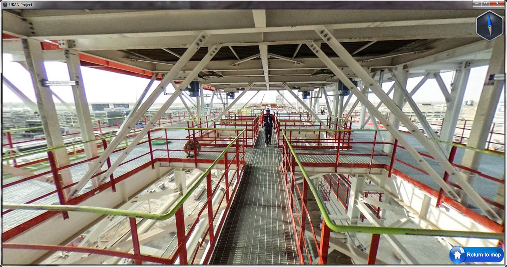
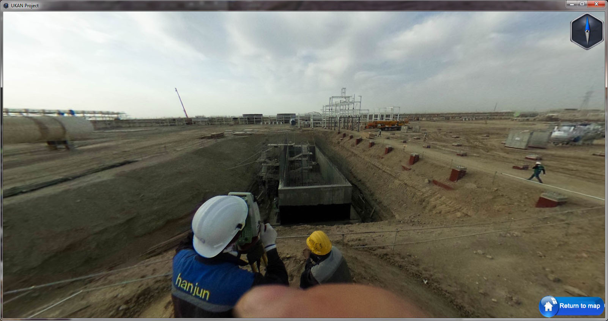

During this project, I was tasked with creating panoramic tours of the construction site of the gas processing plant at the Kandym gas field in Bukhara, Uzbekistan, with the goal of improving construction progress reporting. My responsibilities included acquiring the panoramic images at the construction site and creating a user-friendly viewer, which would allow users to view the panoramic images displayed on a site map. To accomplish this, I implemented the KRPano Viewer, customized it using Javascript API, and embedded it into a portable desktop application using the NW.js framework. 

After completing field data collection, I pinpointed the locations of the panoramic images from their EXIF coordinates onto the site map. Then, I produced the panoramic tours and distributed them to end-users via a local network or flash drives (in cases where users were located in remote areas without access to the local intranet).

## Screenshots (click to enlarge):

   
   
   
   
   

