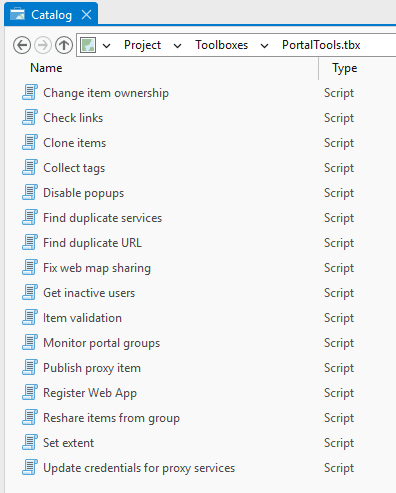
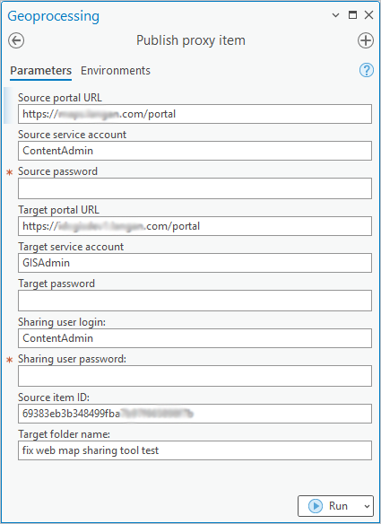
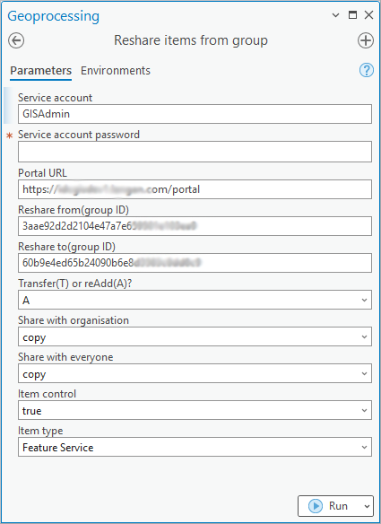
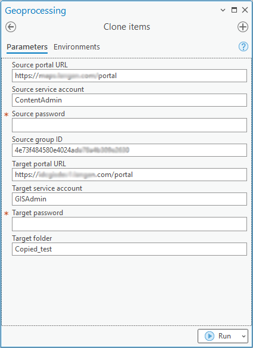

During my internship at Langan, I developed PortalTools, a comprehensive suite of ArcGIS Pro tools and standalone Python scripts designed to streamline various ArcGIS Enterprise and ArcGIS Online administrative tasks. The toolbox includes 16 Python scripts that leverage ArcPy and the ArcGIS API for Python to automate portal item management and other administrative workflows. These tools are intended for use by GIS administrators and advanced users. They can be run from the command line, Jupyter Notebook, ArcGIS Pro, or published as geoprocessing services on ArcGIS Server. Each script and tool is well-documented, with detailed explanations of command-line options, tool parameters, and output handling provided in the script headers and tool metadata. The scripts are environment-aware, detecting the execution context and providing appropriate prompts for parameters and output to ensure a seamless user experience across different platforms. 

## Screenshots (click to enlarge):

   
   
   
   

